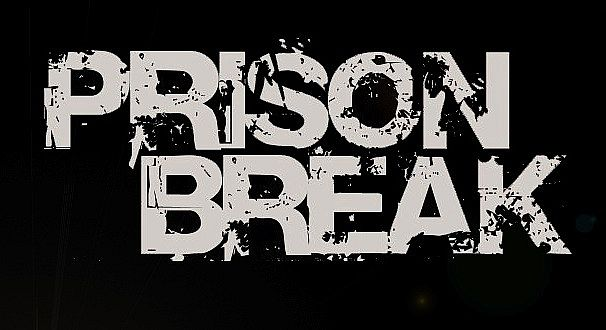
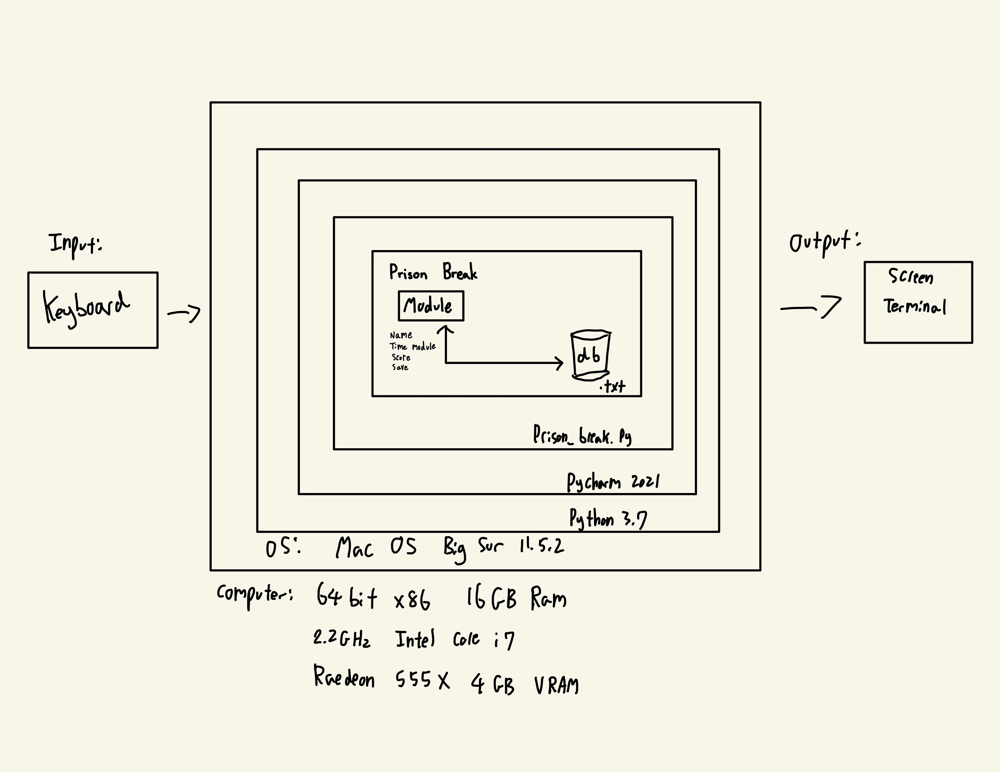
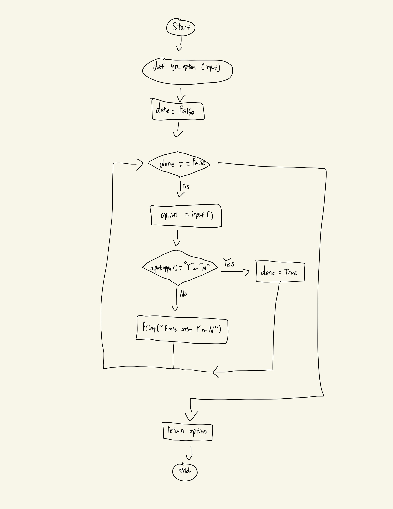
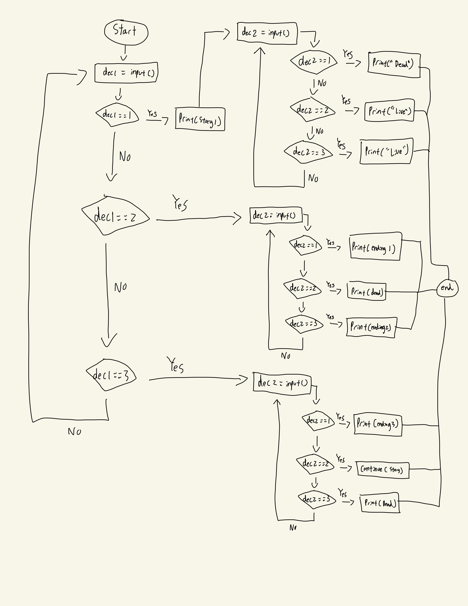

# Unit 1: A classic game 
 

# Criteria A: Planning

## Problem definition

The owner of the local game shop is an enthusiast of classic computer games. He has been looking for a talented programmer that can help him revive his passion for text-based games. He has few requirements for this task:

1. The game has to be entirely text-based.
2. The game must record the time played.
3. The game must record the player name and score.

Apart for this requirements, the owner is open to any type of game, topic or genre.

## Personal Problem definition: 
With the rise of the digital age and GUI based games with fancy 3D graphics and features, all retro games were lost in that process. Since I was young, I have always been a fan of retro games, playing the classic Nintendo 64 and especially a lot of text-based games. These text-based games, although sounds unengaging and boring, has a special place in my heart and I always look back at those good old days where I always struggled to read and finish the game. This nostalgia always caught up to me, and made me question if I was able to create something similar to what I grew up as, and experienced those good old days. 

-----------------------------------------------------------------------------------------------------------------------------------------------------------------

## Proposed Solution




### Design Statement
I will design and create a text-based game for a client who is the local game shop. The category of the game will be a prison break game and will be created in python 3.x. The game will take around 3 weeks to finish and will be evaluated according to the criteria. 


### Justification
The game will be created using python as according to statistictimes.org, it is the most common language in the world and is also the only language I am proficient at. The game will be a text-based game, without any GUI or images to keep the game as less performance and storage hungry as possible. As the only accessible system I have is based on macOS, the game will be coded on a macOS system and on a macOS based python editor called “Pycharm”. I chose Pycharm as I personally find it easy to code on and is also one of the most popular python editors in the world. 

### Details
The genre of the game is an adventure game, and the player has to escape prison through numerous choices and decisions the player has to make the best decisions. The game will consist of a prologue explaining the context of the game and have interactable characters and objects throughout. The game will have at least 3 endings or outcomes and will require at least 10 user inputs to complete game. All 3 endings will be unique and have varying difficulty levels to achieve. The game will keep track of the name and score of the user (as the client requested) and will consist of a basic saving feature to make sure the user has the best experience from playing this game. 


## Success Criteria

The goal of the game will be:
  1. The game has to be entirely text-based
  2. The game must record the time played
  3. The game must record the player name and score
  4. The user can make more than 10 decisions/inputs in the game
  5. Game must have more than 3 outcomes/endings
  6. Must consist a basic start menu

-----------------------------------------------------------------------------------------------------------------------------------------------------------------

# Criteria B: Design

## System Diagram


Fig1.
This shows the system diagram of the game. My system will be based on MAC OS and on a system with a core i7 with 16GB of RAM and 4GB of VRAM. The game will be created on python 3.x and will get an input from keyboard and an output as a text terminal. 
# Flow Diagrams

### Yes or no option def function



### Basic diagram of the story (chapter 1) 


-----------------------------------------------------------------------------------------------------------------------------------------------------------------

## Record of Tasks
| Task NO | Planned Action                                                                                                                                                    | Planned Outcome                                                                                                                                                                  | Time estimate | Target completion date | Criterion |
|---------|-------------------------------------------------------------------------------------------------------------------------------------------------------------------|----------------------------------------------------------------------------------------------------------------------------------------------------------------------------------|---------------|------------------------|-----------|
| 1       | Plan out the whole structure of the game Ask: What kind of endings will there be? How would the user input their decisions? What kind of story line should it be? | Completed all timelines and outcomes with a solid plan Able to answer all questions listed in Planned Action A solid understanding of how the game will function (input, output) | 5 Days        | October 1st            | A         |
| 2       | Finish all of Criteria A Problem definition Proposed Solution Success Criteria                                                                                    | All 3 Criteria A's done and posted on Github (at least 250 words)                                                                                                                | 5 Days        | October 5th            | A         |
| 3       | Draw System Diagram                                                                                                                                               | System Diagram uploaded and done on Github                                                                                                                                       | 1 Days        | October 6th            | B         |
| 4       | Complete type writer def function                                                                                                                                 | All necessary def functions tested and completed                                                                                                                                 | 1 Hour        | October 7th            | C         |
| 5       | Complete clear console def function                                                                                                                               | All necessary def functions tested and completed                                                                                                                                 | 1 Hour        | October 7th            | C         |
| 6       | Complete confirmation def function                                                                                                                                | All necessary def functions tested and completed                                                                                                                                 | 1 Hour        | October 7th            | C         |
| 7       | Make sure all def functions are complete, add new  ones if necessary                                                                                              | All necessary def functions tested and completed                                                                                                                                 | 1 Day         | October 8th            | C         |
| 8       | Finish prologue and context of game                                                                                                                               | All necessary code and dialoge added in the game                                                                                                                                 | 2 Days        | October 10th           | C         |
|         | Refer to plan and create stage for chapter 1:                                                                                                                     |                                                                                                                                                                                  |               |                        |           |
| 9       | Create all inputs and story lines (type out all dialoge and actions)                                                                                              | All inputs correct and story with no typos and logical sense                                                                                                                     | 3 Days        | October 13th           | C         |
| 10      | Check all inputs, clean up any bugs if any                                                                                                                        | All inputs are smooth and has no bugs                                                                                                                                            | 1 Day         | October 14th           | C         |
| 12      | Finish first MVP (minimum viable product) of the game                                                                                                             | Create a video for the g12s to evaluate and show a working prototype                                                                                                             | 1 Day         | October 15th           | C         |
|         | Refer to plan and create stage for chapter 2:                                                                                                                     |                                                                                                                                                                                  |               |                        |           |
| 13      | Create all inputs and story lines (type out all dialoge and actions)                                                                                              | All inputs correct and story with no typos and logical sense                                                                                                                     | 3 Days        | October 16th           | C         |
| 14      | Check all inputs, clean up any bugs if any                                                                                                                        | All inputs are smooth and has no bugs                                                                                                                                            | 1 Day         | October 18th           | C         |
| 15      | Finish Chapter 2 of game (ending 2)                                                                                                                               | Make sure all inputs and outputs make sense and has no infinite loops and is working                                                                                             | 5 Days        | October 20th           | C         |
|         | Refer to plan and create stage for chapter 3                                                                                                                      |                                                                                                                                                                                  |               |                        |           |
| 16      | Create all inputs and story lines (type out all dialoge and actions)                                                                                              | All inputs correct and story with no typos and logical sense                                                                                                                     | 3 Days        | October 23rd           | C         |
| 17      | Check all inputs, clean up any bugs if any                                                                                                                        | All inputs are smooth and has no bugs                                                                                                                                            | 1 Day         | October 24th           |           |
| 18      | Create flow diagram for any of the functions or code                                                                                                              | A illustration of my flow diagram done and uploaded on Github                                                                                                                    | 1 Day         | October 25th           | B         |


-----------------------------------------------------------------------------------------------------------------------------------------------------------------

## First Minimum Viable Product (MVP 1)

A Minimum Viable Product is something like a first demo of the game. In this case, my first ending was my first MVP of the game and consisted of a few basic functions and a basic time and name keeping feature. A video was also made so the G12's would evalute my progress (still awaiting feedback from them). 


```.py
import sys
import time
import os
start_time = time.time()
score=0

#All functions:
#dp = Dramatic Print
def dp(str):
    for char in str:
        sys.stdout.write(char)
        sys.stdout.flush()
        time.sleep(0.01)

def dp1(str):
    for char in str:
        sys.stdout.write(char)
        sys.stdout.flush()
        time.sleep(0.03)

def dp2(str):
    for char in str:
        sys.stdout.write(char)
        sys.stdout.flush()
        time.sleep(0.07)

def dp3(str):
    for char in str:
        sys.stdout.write(char)
        sys.stdout.flush()
        time.sleep(0.25)

#Clear Console
def clearConsole():
    os.system("clear")

#Cut Phrase
def cut():
    print("\n-----------------------------------------------------------------------------------------------------------------------------------")


def c_option(prompt):
    while True:
        try:
            value = int(input(prompt))
        except ValueError:
            print("Please Enter a Value")
            continue
        if value > 4 or value<=0:
            print("Sorry, Please Input 1,2, or 3. ")
            continue
        else:
            break
    return value

#Check phrase if correct
def yn_option():
    repeat=True
    while repeat==True:
        prompt = input("> ")
        if prompt.upper()=="Y" or "N":
            repeat=False
        else:
            print("Sorry, Please Input Y or N. ")
            repeat=True

# Same throughout all ending sequels
def ending():
    print(f"Name: {name}")
    print(f"Play time = {round(time.time() - start_time)} seconds")
    print(f"Score: {score}")

# Encrypting messages
def cypher(shift: int, message: str):
    cypher_message=""
    for i in range (len(message)):
        letter = message[1]
        letter_code = ord(letter)
        shifted_code = letter_code + shift
        if letter_code + shift > 122:
            shifted_code-=26
        cypher_message+=chr(shifted_code)
    return cypher_message

replay = True
while replay == True:
    #Start of game

    print("Would you like to skip the prologue? (Don't skip if it's your first time) Y/N\n")
    skip=input("> ")
    clearConsole()

    #Prologue of game
    if skip.upper() =="N":

        dp3("PROLOGUE.....\n\n")
        dp2("October 24th, 2021\n")
        time.sleep (1)
        dp2("Location:")
        dp1(" Unknown")
        cut()
        time.sleep (2)
        clearConsole()

        dp2("Unknown voice:")
        time.sleep(1)
        dp1(" Hey, Hey yo! Wake up buddy!\n")
        time.sleep(0.5)
        print("You hear someone shouting at you. \n")
        time.sleep (2)
        dp1("You recall what happened in the past hour and you remember that you were running away from Mrs.Earwood and had tripped on a banana. \n \n")
        time.sleep (1)
        dp1("You are utterly confused on what's going on")
        for i in range (5):
            time.sleep (0.5)
            dp1(".")
        cut()
        time.sleep (2)
        clearConsole()

        dp2("Unknown voice:")
        time.sleep(0.5)
        dp1(" Yo! Yo, buddy c'mon wake up new guy. \n")
        time.sleep(0.5)
        print("You jump out of bed and observe your surroundings.\n")
        time.sleep(1)
        dp1("You see a big man standing right next to your bed.\n")
        time.sleep(1)
        dp1("It seems like you have somehow landed in prison.\n")
        cut()
        time.sleep(2)
        clearConsole()

        dp2("Big Man: ")
        time.sleep(0.5)
        dp1("Yo! New guy! What's your name, mate?\n")
        name = input("You: > ")
        dp1(f"Big man: {name}")
        for i in range (3):
            dp1(".")
            time.sleep(1)
        dp1(" \nWell nice to meet you. ")
        time.sleep(1)
        dp1("My name's Koshiba and a sincere welcome to ")
        dp3("ISAK PRISON.")
        cut()
        time.sleep(2)
        clearConsole()

        dp1("Chapter 1: ")
        dp2("Start of a new journey...\n\n")
        time.sleep(2)
        dp1("1 week later")
        for i in range (5):
            dp1(".")
            time.sleep(1)
        time.sleep(1)
        clearConsole()

        dp1("You're already tired of this place, and sick of the repetitive nature of ISAK Prison.\n\n")
        time.sleep(1)
        dp1("And so you decide to escape from this filthy prison.")
        time.sleep(2)
        skip="N"
        clearConsole()
        #Finish of prologue
    else:
        dp1("What is your name?\n\n")
        name = input("> ")

    #Start of game
    clearConsole()
    time.sleep(0.5)

    done1=False
    glass=False
    while done1==False:
        clearConsole()
        dp1("You look around your surroundings and find a few items...")
        if glass==True:
            dp1("\n\nBut now you have a shard of glass in your hand")
        dp("\n\nPress 1 to view the window \n\n")
        dp("Press 2 to view the vent \n\n")
        dp("Press 3 to view the mirror\n\n")
        dec1 = c_option("> ")
        clearConsole()

        if dec1 == 1:
            dp1("You observe the windows length and width\n\n")
            for i in range(5):
                time.sleep(0.5)
                dp1(".")
            dp1("\n\nIt look's like you will be able to fit through the window.\n\n")
            dp("Press 1 to squeeze through the small window \n\n")
            dp("Press 2 to observe the vent instead \n\n")
            dp("Press 3 to observe the mirror instead \n\n")
            dec11 = c_option("> ")
            if dec11 == 1:
                clearConsole()
                dp1("You squeeze through the window and see sunlight, you finally squeeze yourself outside the window, until you realize...\n\n")
                time.sleep(2)
                dp1("Your prison is on the 20th floor.\n\n")
                time.sleep(2)
                dp1("You free fall straight down to the ground and your life flashes right infront of you.\n\n")
                for i in range(5):
                    time.sleep(0.5)
                    dp1(".")
                dp1(f"\n\n{name}> ")
                time.sleep(0.5)
                dp2("I'm an actual idiot.\n")
                time.sleep(1)
                dp("Those were your last words")
                cut()
                time.sleep(4)
                clearConsole()

                #Ending 1:
                dp3("Ending 1:")
                time.sleep(0.5)
                dp2(" Think before you act...\n")
                ending()
                cut()
                with open("savefile.txt", "a") as file:
                    data = f"name: {name},score: {score},ending: {ending},time: {round(time.time() - start_time)}"
                dp1("Would you like to play again? (Y/N)\n\n")
                replay1=input("> ")
                if replay1.upper()=="N":
                    replay=False
                else:
                    continue
                quit()
            if dec11 == 2 or 3:
                clearConsole()
                dp1("You think again about your decision and realize you're prison cell is located on the 20th floor.\n\n")
                time.sleep(0.5)
                dp1("Jumping out would've been a bad idea.\n\n")
                time.sleep(2)
                if dec11 == 2:
                    dec1 = 2
                    clearConsole()
                if dec11 == 3:
                    dec1 = 3
                    clearConsole()
        if dec1 == 3:
            dp1("You observe the glass and decide to break it.\n\n")
            time.sleep(1)
            dp1(f"{name}> The glass shards might come in useful...\n\n")
            time.sleep(1)
            clearConsole()
            glass = True
        if dec1 == 2:
            if glass == True:
                dp1("You observe the vents, and it's completely screwed on. But now you have a piece of glass in your hand\n\n")
                dp1("You use the glass shards to unscrew the vents\n\n")
                for i in range(5):
                    time.sleep(0.5)
                    dp1(".")
                dp1("\n\nThe vent opens\n\n")
                time.sleep(0.5)
                dp1("You grab the side of the wall and push yourself up into the vent")
                time.sleep(3)
                done1=True
                clearConsole()
            else:
                dp1("You observe the vents, and it's completely screwed on. Maybe you can use something to unscrew it")
                for i in range(3):
                    time.sleep(0.5)
                    dp1(".")
                time.sleep(3)

    #Chapter 2
    dp3("Chapter 2: Inside the vents...\n\n")
    cut()
    time.sleep(2)
    clearConsole()
    dp1("You crawl through the vents. Everything seems fine and you keep pushing your self through the tight space.\n")
    time.sleep(2)
    dp1("Until the vents split into two directions, Right and Left\n\n")
    time.sleep(2)
    clearConsole()
    dp1("You have a good look and the right side seems like there's light on the other side and the left side is full of rats...\n")
    time.sleep(1)
    dp1("Which one would you choose?")
    dp("Press 1 to go right\n\n")
    dp("Press 2 to go left \n\n")
    dec2=c_option("> ")
    if dec2=="1":
        clearConsole()
        dp1("You decide to go right towards the light\n")
        dp1("You think the light will lead you to an exit and to freedom\n\n")
        dp1("You keep crawling throgh the vents towards the light, it came closer and closer\n\n")
        for i in range(3):
            time.sleep(0.5)
            dp1(".")

    if dec2=="2":
        dp1("You decide to go left away from the dark\n")
        dp1("You're a brave soul and you believe that the light is just a mere distraction so you decide to go away from it \n")
        dp1("")
        clearConsole()

    clearConsole()
```
