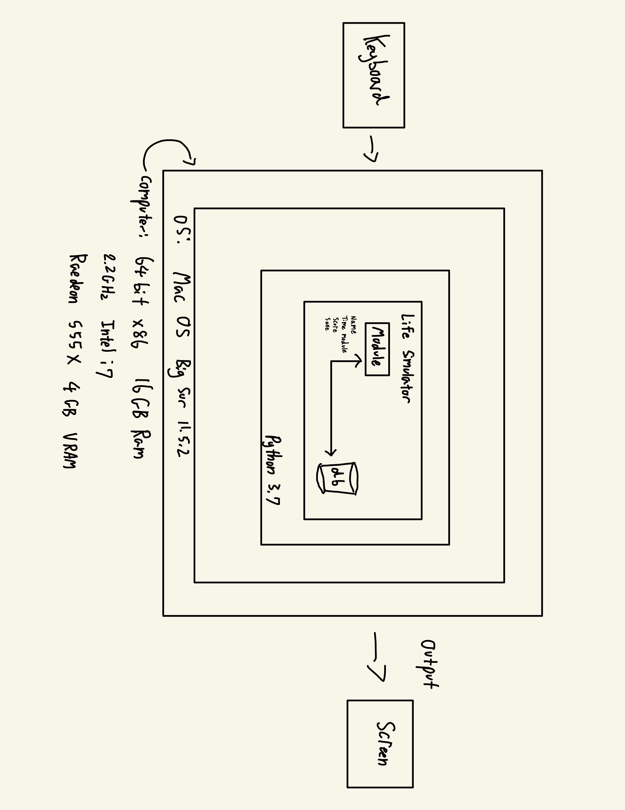

# Unit 1: A classic game 

# Criteria A: Planning

## Problem definition

The owner of the local game shop is an enthusiast of classic computer games. He has been looking for a talented programmer that can help him revive his passion for text-based games. He has few requirements for this task:

1. The game has to be entirely text-based.
2. The game must record the time played.
3. The game must record the player name and score.

## Personal Problem definition: 
With the rise of the digital age and GUI based games with fancy 3D graphics and features, all retro games were lost in that process. Since I was young, I have always been a fan of retro games, playing the classic Nintendo 64 and especially a lot of text-based games. These text-based games, although sounds unengaging and boring, has a special place in my heart and I always look back at those good old days where I always struggled to read and finish the game. This nostalgia always caught up to me, and made me question if I was able to create something similar to what I grew up as, and experienced those good old days. 

Apart for this requirements, the owner is open to any type of game, topic or genre.

## Proposed Solution

### Design Statement
I will design and create a text-based game for a client who is the local game shop. The category of the game will be a prison break game and will be created in python 3.x. The game will take around 3 weeks to finish the project and will be evaluated according to the criteria. 

### Justification
The game will be created using python as according to statistictimes.org, it is the most common language in the world and is also the only language I am proficient at. The game will be a text-based game, without any GUI or images to keep the game as less performance and storage hungry as possible. As the only accessible system I have is based on a macOS architecture, the game will be coded on a macOS system and on a macOS based python editor called “Pycharm”. I chose Pycharm as I personally find it easy to code on and is also one of the most popular python editors in the world. 

### Details
The genre of the game is an adventure game, and the player has to escape prison through numerous choices and decisions the player has to make the best decisions. The game will consist of a prologue explaining the context of the game and have interactable characters throughout. The game will have at least 3 endings or outcomes and will require at least 10 user inputs to complete game. All 3 endings will be unique and have varying difficulty levels to achieve. The game will keep track of the name and score of the user (as the client requested) and will consist of a basic saving feature for every checkpoint to make sure the user has the best experience from playing this game. 

## Success Criteria

The goal of the game will be:
  1. The game has to be entirely text-based
  2. The game must record the time played
  3. The game must record the player name and score
  4. The user can make more than 10 decisions/inputs in the game
  5. Game must have more than 3 outcomes/endings
  6. Must consist a basic start menu
  7. Must have check points and auto saves
  8. Include sound effects 

# Criteria B: Design

## System Diagram

## Flow Diagrams

## Record of Tasks
| Task NO | Planned Action                                                                                                                                                    | Planned Outcome                                                                                                                                                                  | Time estimate | Target completion date | Criterion |
|---------|-------------------------------------------------------------------------------------------------------------------------------------------------------------------|----------------------------------------------------------------------------------------------------------------------------------------------------------------------------------|---------------|------------------------|-----------|
| 1       | Plan out the whole structure of the game Ask: What kind of endings will there be? How would the user input their decisions? What kind of story line should it be? | Completed all timelines and outcomes with a solid plan Able to answer all questions listed in Planned Action A solid understanding of how the game will function (input, output) | 5 Days        | October 1st            | A         |
| 2       | Finish all of Criteria A Problem definition Proposed Solution Success Criteria                                                                                    | All 3 Criteria A's done and posted on Github (at least 250 words)                                                                                                                | 5 Days        | October 5th            | A         |
| 3       | Draw System Diagram                                                                                                                                               | System Diagram uploaded and done on Github                                                                                                                                       | 1 Days        | October 6th            | B         |
| 4       | Complete type writer def function                                                                                                                                 | All necessary def functions tested and completed                                                                                                                                 | 1 Hour        | October 7th            | C         |
| 5       | Complete clear console def function                                                                                                                               | All necessary def functions tested and completed                                                                                                                                 | 1 Hour        | October 7th            | C         |
| 6       | Complete confirmation def function                                                                                                                                | All necessary def functions tested and completed                                                                                                                                 | 1 Hour        | October 7th            | C         |
| 7       | Make sure all def functions are complete, add new  ones if necessary                                                                                              | All necessary def functions tested and completed                                                                                                                                 | 1 Day         | October 8th            | C         |
| 8       | Finish prologue and context of game                                                                                                                               | All necessary code and dialoge added in the game                                                                                                                                 | 2 Days        | October 10th           | C         |
| 9       | Finish Chapter 1 of game (ending 1)                                                                                                                               | Make sure all inputs and outputs make sense and has no infinite loops and is working                                                                                             | 5 Days        | October 14th           | C         |
| 10      | Finish first MVP (minimum viable product) of the game                                                                                                             | Create a video for the g12s to evaluate and show a working prototype                                                                                                             | 1 Day         | October 15th           | C         |
| 11      | Finish Chapter 2 of game (ending 2)                                                                                                                               | Make sure all inputs and outputs make sense and has no infinite loops and is working                                                                                             | 5 Days        | October 20th           | C         |
|         | Finish Chapter 3 of game (ending 3)                                                                                                                               | Make sure all inputs and outputs make sense and has no infinite loops and is working                                                                                             | 5 Days        | October 25th           | C         |
